小组成员：韩雨坤（MC56909） 杜佳洺（MC）
[StyleShift-设计演示.html](https://github.com/user-attachments/files/26385462/StyleShift-.html)
<!DOCTYPE html>
<html lang="zh-CN">
<head>
<meta charset="UTF-8">
<meta name="viewport" content="width=device-width, initial-scale=1.0">
<title>StyleShift：为设计师打造的直观风格转换工具</title>

</head>
<body>

<button type="button" class="lang-float-btn" id="deckLangBtn" title="Switch language / 切换语言" aria-live="polite">
  <svg width="17" height="17" viewBox="0 0 24 24" fill="none" stroke="currentColor" stroke-width="2" aria-hidden="true"><circle cx="12" cy="12" r="10"/><path d="M2 12h20M12 2a15.3 15.3 0 014 8 15.3 15.3 0 01-4 8 15.310 15.310 0 01-4-8 15.310 15.310 0 014-8z"/></svg>
  English
</button>

<button type="button" class="nav-btn prev" id="prev" aria-label="上一页">‹</button>
<button type="button" class="nav-btn next" id="next" aria-label="下一页">›</button>

← → / 空格翻页 · 亦可左右滑动

  <!-- 0 封面 -->
  <section class="slide slide--cover active" data-slide="0">
    
视觉风格探索 · 设计陈述

    <h1 class="cover-title-line" data-i18n="d0.h1">StyleShift：为设计师打造的直观风格转换工具</h1>
  </section>

  <!-- 一、为什么制作 -->
  <section class="slide" data-slide="1">
    
一、为什么制作这个工具？

    <h2 data-i18n="d1.h2">目标与痛点</h2>
    
<strong class="highlight">目标用户：</strong>视觉传达设计师、插画师、创意工作者。

    
<strong class="highlight">设计痛点：</strong>

    <ul>
      <li data-i18n-html="d1.li1">想尝试不同风格时，需要在<strong>多个软件间来回切换</strong>，流程繁琐。</li>
      <li data-i18n-html="d1.li2">风格迁移结果<strong>不可控</strong>，无法便捷地做局部调整。</li>
      <li data-i18n-html="d1.li3"><strong>灵感探索效率低</strong>，难以快速对比多种视觉方向。</li>
    </ul>
    
<strong class="highlight">我们的解决方案：</strong>StyleShift 帮助设计师在设计过程中快速完成风格转换，<strong>一键查看相同元素的不同风格</strong>，节省时间，激发灵感。

  </section>

  <!-- 二、1 风格探索 -->
  <section class="slide" data-slide="2">
    
二、如何在视觉传达设计过程中使用？

    <h2 data-i18n="d2.h2">1. 风格探索</h2>
    
StyleShift 贯穿设计的<strong>探索阶段与深化阶段</strong>。

    
上传设计稿，在油画、水彩、赛博朋克、水墨等多种风格间自由切换，快速预览不同风格的视觉表现，帮助设计师<strong class="highlight">拓宽思路</strong>。

    <figure class="slide-photo">
      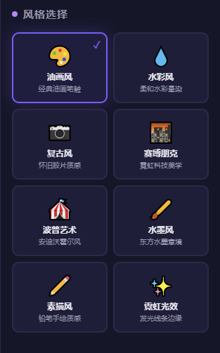
    </figure>
  </section>

  <!-- 二、2 元素提取与融合 -->
  <section class="slide" data-slide="3">
    
二、如何在视觉传达设计过程中使用？

    <h2 data-i18n="d3.h2">2. 元素提取与融合</h2>
    
通过<strong>「元素拆解」</strong>功能，自动提取画面中的色块元素；可以对<strong>局部</strong>进行单独风格转换，或将多种风格<strong>融合在同一画面中</strong>，形成新的、复合的设计语言。

    <figure class="slide-photo slide-photo--wide">
      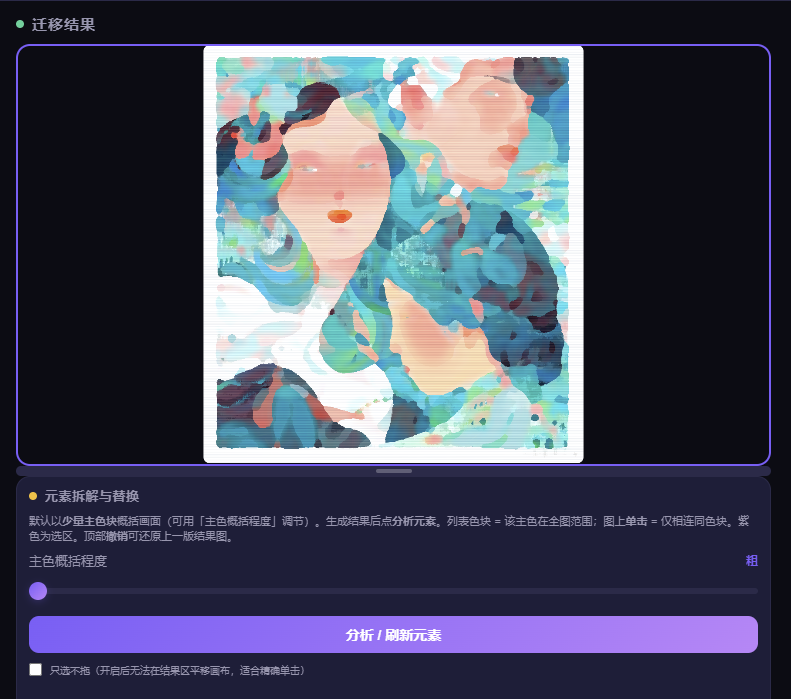
    </figure>
  </section>

  <!-- 二、3 精细化调整 -->
  <section class="slide" data-slide="4">
    
二、如何在视觉传达设计过程中使用？

    <h2 data-i18n="d4.h2">3. 精细化调整</h2>
    
支持对选区进行<strong>风格强度</strong>等参数微调；可通过<strong>色调叠加</strong>（全局）、<strong>颜色覆盖</strong>等方式调整画面气质，使最终效果更贴合设计意图。

    <figure class="slide-photo slide-photo--wide">
      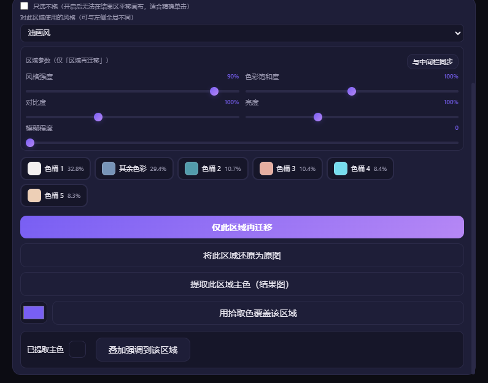
    </figure>
  </section>

  <!-- 三、决策一 -->
  <section class="slide" data-slide="5">
    
三、关键的 UI/UX 设计决策与原因

    <h2 data-i18n="d5.h2">决策一：从「整体」到「局部」的功能演进</h2>
    
<strong>初始设想：</strong>仅支持<strong>整张图片</strong>的风格迁移，满足基本的风格探索需求。

    
<strong>发现问题：</strong>设计师往往只需要改变画面中的<strong>某个局部</strong>（如主体物、背景），而非整张图。整体迁移会导致不需要改变的部分也被「改过头」，破坏原有设计。

    
<strong>迭代方向：</strong>将<strong>局部选区与编辑</strong>作为改进版的核心功能，使设计师能够：<strong>精确控制修改范围</strong>、<strong>保留画面核心结构</strong>、实现<strong>多种风格在同一画面中的融合</strong>。

  </section>

  <!-- 三、决策二 -->
  <section class="slide slide--wide-copy" data-slide="6">
    
三、关键的 UI/UX 设计决策与原因

    <h2 data-i18n="d6.h2">决策二：色块智能选区，降低操作门槛</h2>
    
<strong>设计思路：</strong>传统选区工具（如魔棒、套索）参数复杂、操作繁琐。我们利用图像分析<strong>自动提取主色块</strong>，用户只需：

    <ul>
      <li data-i18n-html="d6.li1"><strong>点击色块列表</strong> → 选中全图同色区域；</li>
      <li data-i18n-html="d6.li2"><strong>点击画面上某处</strong> → 智能选中相连的同色区域。</li>
    </ul>
    
<strong>设计原因：</strong>让设计师<strong>无需学习复杂选区工具</strong>，即可快速定位想要修改的区域，把精力集中在创意本身。

    

      <figure class="slide-photo slide-photo--wide">
        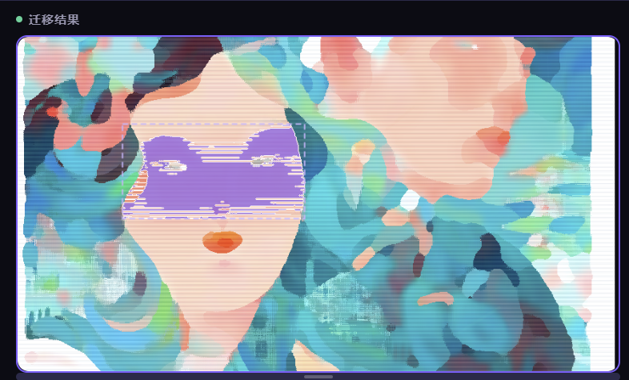
      </figure>
      <figure class="slide-photo slide-photo--wide">
        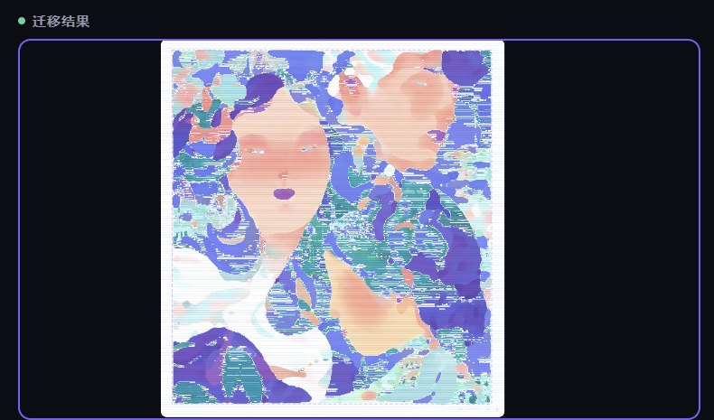
      </figure>
    

  </section>

  <!-- 三、决策三 -->
  <section class="slide slide--wide-copy" data-slide="7">
    
三、关键的 UI/UX 设计决策与原因

    <h2 data-i18n="d7.h2">决策三：三栏布局 + 对比视图</h2>
    
<strong>布局逻辑：</strong><code style="color:var(--accent2)">原始作品 | 风格选择 | 迁移成果</code>——从左到右遵循<strong>「输入 → 处理 → 输出」</strong>的心理模型，所有操作在一个界面完成，无需跳转。

    
<strong>对比视图：</strong>支持<strong>拖动分界线</strong>左右对比原图和效果图，比传统「前后切换」更直观，尤其适合<strong>设计评审与方案汇报</strong>。

    
补充：界面提供<strong>中英文切换</strong>、右侧<strong>可拖拽分隔条</strong>调节预览区与工具区高度，便于教学演示与小屏设备使用。

    

      <figure class="slide-photo slide-photo--wide">
        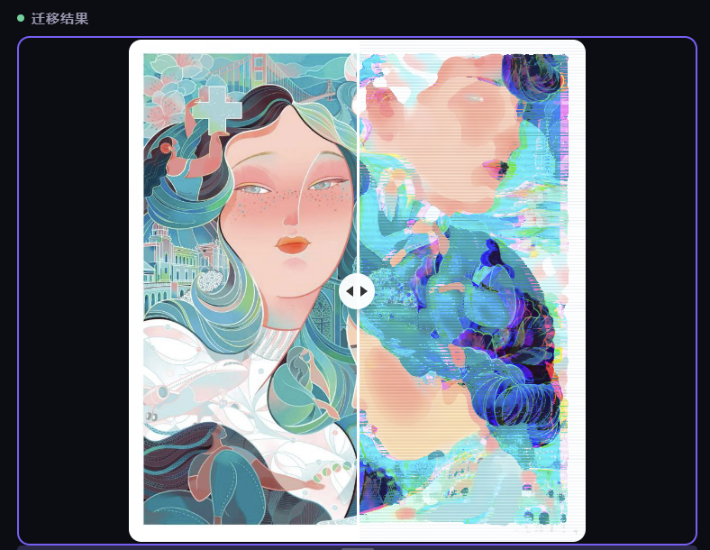
      </figure>
      <figure class="slide-photo slide-photo--wide">
        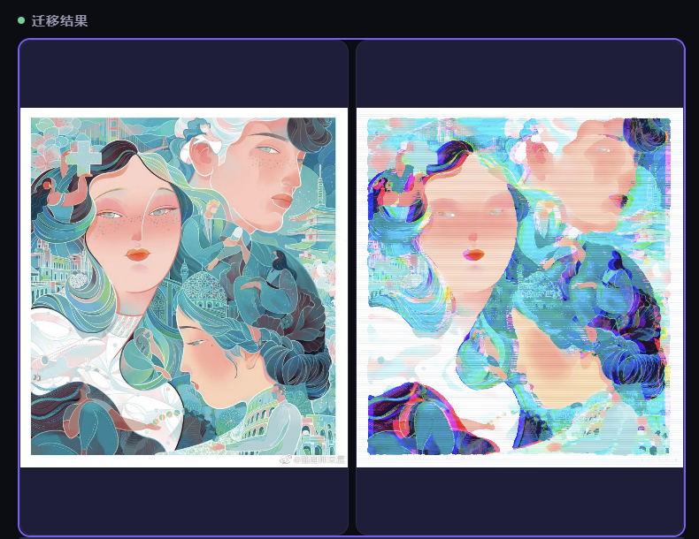
      </figure>
    

  </section>

  <!-- 三、决策四 -->
  <section class="slide slide--wide-copy" data-slide="8">
    
三、关键的 UI/UX 设计决策与原因

    <h2 data-i18n="d8.h2">决策四：历史记录 + 撤销</h2>
    
<strong>设计原因：</strong>创意过程需要反复尝试。<strong>历史条</strong>让用户可以保存多个版本进行比较；<strong>撤销</strong>降低试错成本，鼓励大胆探索。

    <figure class="slide-photo slide-photo--panorama">
      
    </figure>
  </section>

  <!-- 附录：操作 ① 三栏 -->
  <section class="slide slide--wide-copy" data-slide="9">
    
附录 · 操作示意

    <h2 data-i18n="d9.h2">① 整体界面：左图 · 中控 · 右结果</h2>
    
与「设计风格迁移-改进版」一致：<strong>左侧</strong>上传原图，<strong>中间</strong>选风格与参数并生成，<strong>右侧</strong>看结果与后续拆解工具。

    
<strong class="highlight">顶栏另有：</strong>语言切换、撤销、重置、导出。

    <figure class="slide-photo slide-photo--panorama">
      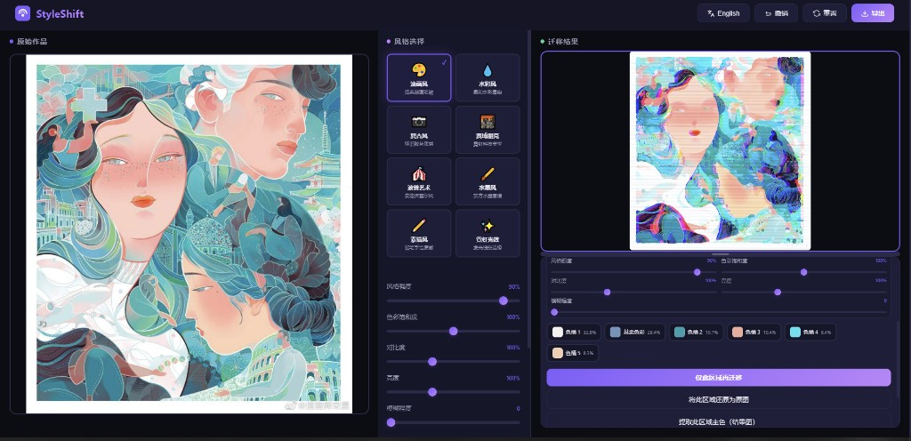
    </figure>
  </section>

  <!-- 10 操作：上传 -->
  <section class="slide slide--wide-copy" data-slide="10">
    
附录 · 操作示意

    <h2 data-i18n="d10.h2">② 上传原图</h2>
    
在左侧虚线区域内<strong>点击选择文件</strong>，或将图片<strong>拖入</strong>该区域。支持常见网页图片格式（以工具内说明为准）。

    
上传成功后，中间「生成」按钮会变可用。

    <figure class="slide-photo slide-photo--upload">
      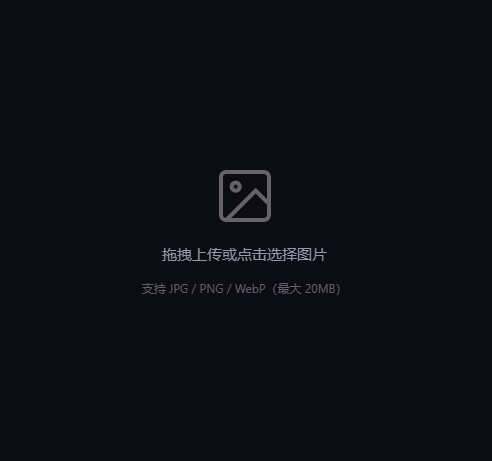
    </figure>
  </section>

  <!-- 11 操作：选风格生成 -->
  <section class="slide slide--wide-copy" data-slide="11">
    
附录 · 操作示意

    <h2 data-i18n="d11.h2">③ 选风格、调滑块、点「生成风格迁移」</h2>
    
在中间栏点选一种风格卡片 → 按需拖动强度、饱和度等 → 可选色调叠加（色点）→ 切换「效果图 / 对比 / 分屏」为生成后的查看方式 → 点击紫色主按钮<strong>生成</strong>。

    

      <figure class="slide-photo slide-photo--wide">
        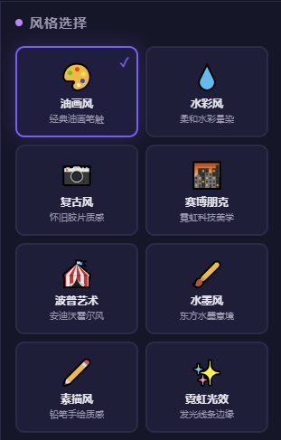
      </figure>
      <figure class="slide-photo slide-photo--wide">
        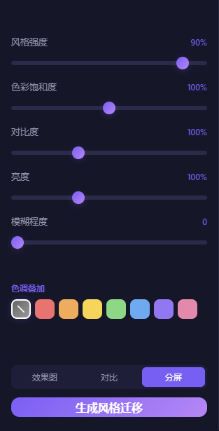
      </figure>
    

  </section>

  <!-- 12 操作：对比分屏 -->
  <section class="slide" data-slide="12">
    
附录 · 操作示意

    <h2 data-i18n="d12.h2">④ 查看结果：效果图 / 对比 / 分屏</h2>
    
<strong>对比</strong>：在<code style="color:var(--accent2)">同一画面</code>内拖动竖线，左为原图侧、右为结果侧。<strong>分屏</strong>：左右两栏分别完整显示原图与结果。

    
右栏大图区悬停可出现缩放与下载。

  </section>

  <!-- 13 操作：元素拆解 -->
  <section class="slide slide--wide-copy" data-slide="13">
    
操作演示

    <h2 data-i18n="d13.h2">⑤ 元素拆解：分析 → 选色块 / 点画面 → 局部再迁移</h2>
    
生成结果后，右下出现面板：先点<strong>分析 / 刷新元素</strong> → 列表中点色块或<strong>在图上点选相连区域</strong>（紫色为选区）→ 为此区域选风格、调区域参数与色桶 → 点<strong>仅此区域再迁移</strong>。

    <figure class="slide-photo slide-photo--wide">
      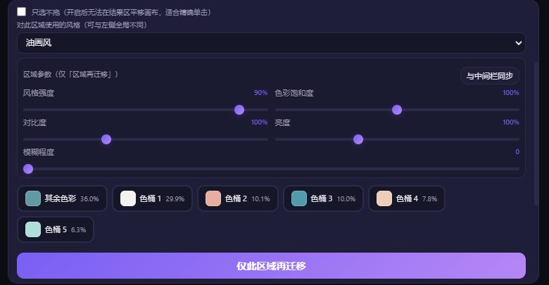
    </figure>
  </section>

  <!-- 14 四、总结 -->
  <section class="slide" data-slide="14">
    
四、总结

    <h2 data-i18n="d14.h2">StyleShift 的核心价值</h2>
    
将强大的风格迁移能力，转化为设计师手中<strong class="highlight">直观、可控的创作工具</strong>。

    
我们不是简单地做「一键换风格」，而是从<strong class="highlight">设计工作的真实场景</strong>出发：

    <ul>
      <li data-i18n-html="d14.li1"><strong>从整体到局部：</strong>先满足基础的整图风格探索，再迭代出<strong>色块智能选区 + 局部风格转换</strong>，让设计师可以精准控制修改范围。</li>
      <li data-i18n-html="d14.li2"><strong>服务于创作流程：</strong>覆盖从灵感发散、风格对比，到元素融合、精细化调整的全过程，让工具真正融入设计工作流。</li>
    </ul>
    
最终，StyleShift 不只是一种技术实现，更是对<strong class="highlight">设计创作自由</strong>的一次回应——让风格不再是一次性的整体套用，而是可以被<strong>拆解、重组、局部打磨</strong>的灵活语言。

  </section>

</body>
</html>
